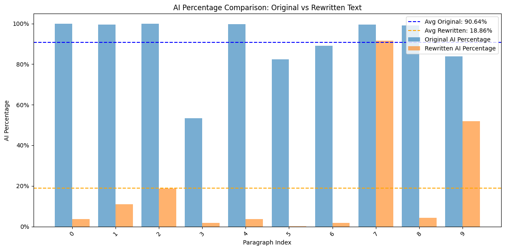

# Fine-Tuning Large Language Models for Writing Style: Approach and Results

An automated and scalable approach to fine-tuning OpenAI's models for writing style. The objectives were to humanize AI-generated text, match an individual or organization’s voice, and pass AI detection tools as human. Notable improvements along all these axes were observed after fine-tuning on just 50 paragraphs, but with better results after 500. 

Crucially, this approach does not require any human work to create a training dataset and means that any idivdual or organsiation posessing a corpus of human written documents can quickly obtain a high quality dataset for fine-tuning in their own style.

This method is intended as a separate re-writing step, applied after the initial content generation. By decoupling content creation from style transformation, the approach ensures that the original model's generality and content quality are preserved, while the final output is tailored to the desired writing style.

A potential use case for the fine-tuned model could be to serve as a final step in an agentic content writing system.

## Why Not Direct Preference Optimization (DPO)?

While OpenAI recommends Direct Preference Optimization (DPO) for tone and style generation, we chose supervised fine-tuning for two key reasons:
- The seperation of content generation from style transformation avoids any risk that fine-tuning reduces quality of initial content creation.
- In our approach, only the AI version of each paragraph needs to be generated, there is no need to also reverse engineer the prompt, reducing the role of generated content in training.

> **To follow this approach and generate your own fine-tuning dataset, run `fine_tuning_dataset_pipeline.ipynb`.**


## Data Preparation and Methodology

### Dataset Creation Process

The fine-tuning dataset was constructed through a multi-step process:

1. **Extraction of High-Quality Human Writing:**
   - Paragraphs were extracted from professionally written reports, authored by a single invididual.

2. **Generation of LLM Versions:**
   - Each extracted paragraph was rewritten using a GPT-4.1 to produce an AI-generated version.

    System Prompt:
    > "You are a report writing editor. Respond with the re-written text only, without any additional commentary or explanation."

    User Prompt:
     > "Re-write the following text to make it as good as possible. You should maintain all the meaning, however you should change order, structure, word choice etc. to improve it. Input text: {human_paragraph}"

3. **Reversing the Order for Fine-Tuning:**
   - For the fine-tuning dataset, the LLM re-written version was used as the "input" (original), and the high-quality human-written paragraph was used as the "target" (desired output). The same systems and user prompts were used as in step 2 and saved as a JSONL file, required for OpenAI fine-tuning.

### Example JSONL Entry

```json
{"messages": [
  {"role": "system", "content": "You are a report writing editor. Respond with the re-written text only, without any additional commentary or explanation."},
  {"role": "user", "content": "Re-write the following text to make it as good as possible. You should maintain all the meaning, however you should change order, structure, word choice etc. to improve it. Input text: ..."},
  {"role": "assistant", "content": "...rewritten text..."}
]}
```

## Evaluation & Results

The main evaluation metric was the GPTZero checker (which appeared to be the most sensitive checker in our testing). To test, we took 10 AI generated paragraphs about a range of topics and re-wrote them using the fine-tuned model (using the same system and user prompt as in fine-tuning). The fine-tuned model's outputs always received lower AI generated scores with the aeverage AI percentage going from 91% to 19% and 7 out of 10 of the re-written texts classified as 'We are highly confident this text is entirely human'.



Additional testing involved blind evaluation by a professional content editor, who was asked to choose between the original and the model-rewritten versions of each paragraph. In 9 out of 10 cases, the professional identified the model-rewritten versions as more human.

>"AI-generated content often comes across as unnaturally concise compared to how people typically write. It tends to use precise, but sometimes unusual, word choices. In contrast, human writing usually sounds more like natural speech—in both the words we choose and how we structure sentences. The output from the fine-tuned model felt more like something you’d actually say out loud. It flowed better and the language felt more natural and approachable."

Although the model was fine-tuned on individual paragraphs, it was also tested on re-writing entire documents in a single pass. The model performed well in this scenario, maintaining coherence and significantly lowering AI detection scores.
